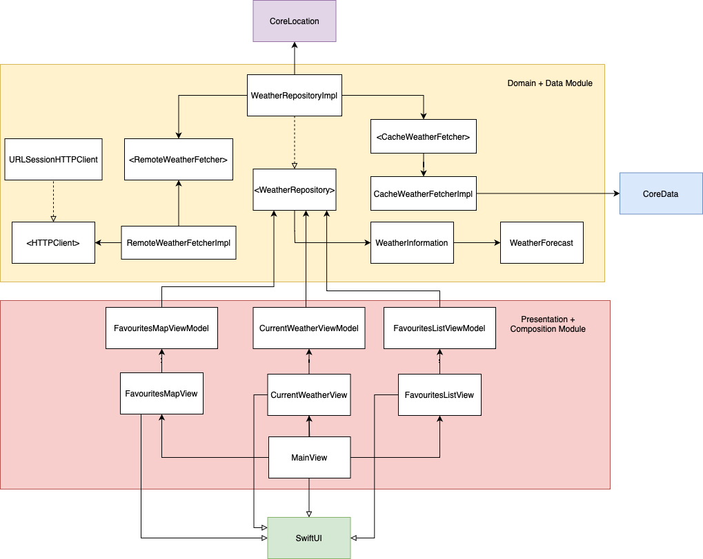

# Weather App

[](https://github.com/alexdmotoc/dvt-weather-app/actions/workflows/CI.yml)[](https://github.com/alexdmotoc/dvt-weather-app/actions/workflows/CI_iOS.yml)

## About the app

The app has 4 screens: Weather, Favourites, Map and Settings.

In the Weather tab you can see the weather for the current location. If you don't allow location permissions you will see a custom UI that will indicate you should enable permissions. Once the user changes location, that is every 5 km, the app fetches the weather for the new current location + any favourites the user might have added, to ensure weather information is updated accross the board. There is also a refresh button that does the same thing: fetches the weather for the current location + any other favourite locations.

The Favourites tab allows the user to search for a location and add it as favourite. The app will fetch the weather information for that location and add it to the list of favourites. By longpressing, the user can delete a favourite location.

The Map section displays a map with pins for the user's saved locations.

Finally, the Settings tab allows the user to switch between Celsius and Fahrenheit temperatures.

The app is created with SwiftUI and the Weather, Map and Settings views are SwiftUI native. The Favourites view is implemented with UIKit, in order to have a mix of the 2 technologies.

### Considerations

When fetching the weather information for a location, we execute 2 API calls, one for the current weather information, one for the forecast. The forecast received from the API is for 5 days, with a 3 hour step, meaning we will get 40 entries. These entries are averaged such that we only display 5 items in the forecast section, one for each day.

When searching for a favourite location, it may be that the name of the location displayed by the app after it's added doesn't match the name the user selected when he searched for the location. This is because we are using the name returned by the API as a source of truth. For example the user searches for Paris and our search algorithm returns some coordinates; when we feed those coordinates into the OpenMaps API, it may be that it returns the name of the neighbourhood for those coordinates, instead of the city name.

## Specs

In the following section I added the specifications for the application in a user-story based approach, in order to be clear what the app needs to do.

### Story: User requests to see the weather for his current location

### Narative #1

```
As an online geolocated user
I want to be able to see the weather information for my current location
  together with a 5-day forecast and an indication of the last updated date (timestamp)
```

#### Acceptance criteria

```
Given the user has internet connectivity and provided location permissions
  When he requests to see the weather for his current location
    The current location weather is fetched from API and displayed
    The 5-day forecast is fetched from API and displayed
    The old cache is replaced with the new weather information
    A label indicating the last update is displayed
``` 

### Narative #2

```
As an offline geolocated user
I want to be able to see the cached weather information
  together with an indication of the last updated date (timestamp)
```

#### Acceptance criteria

```
Given the user has no internet connectivity,
  When he requests to see the weather for his current location
  And there is cached weather information
    The current location weather is fecthed from the cache and displayed
    The 5-day forecast if fetched from the cache and displayed
    A label indicating the last update is displayed
    
Given the user has no internet connectivity,
  When he requests to see the weather for his current location
  And there is no cached weather information
    An empty view is displayed
```

### Narative #3

```
As a non-geolocated (didn't give location permission) user (online/offline)
    I want to see an option to go to Settings app and enable geolocation
```

#### Acceptance criteria

```
Given the user didn't accept location permissions,
  When he opens the app to view current weather information
    The app will display a message to go to Settings and enable location permissions
```

### Story: User requests to see the weather information for his favourite locations

### Narative

```
As a user, I want to be able to add favourite locations and see the weather information
```

#### Acceptance criteria

```
Given the user opens the app,
  When he navigates to the Favourites area
    He will be able to add a new city as favourite and see weather information
```

### Story: User requests to see favourite locations on map

### Narative

```
As a user, I want to be able to see my favourite locations on a map
```

#### Acceptance criteria

```
Given the user opens the app,
  When he navigates to the Map area
    He will be able to see his favourite locations on the map
```

### Story: User wants to change temperature in Settings

### Narative

```
As a user, I want to be able to change the temperature format displayed from Celsius to Fahrenheit and vice-versa. I want these changes to be persisted between app launches.
```

#### Acceptance criteria

```
Given the user opens the app,
  When he navigates to the Settings area
    He will be able to select the temperature format from Celsius and Fahrenheit. The app should update the UI to reflect his change. 
```

## App Architecture

In the diagram below we can observe a high level overview of the app's architecture. It is based on MVVM. 

There are 2 modules, one for the domain (i.e. Models) and data-related types (i.e. API/Cache/UseCases) + the other for composition and presentation (i.e. the main iOS app).

Having a specific module for domain and data types allows us to run tests on a macOS target which is a lot faster than running the tests on the iOS target, as there is no simulator that needs to be booted up.

In the diagram we can observe a few types in angular brackets `<LikeThis>`, this means this type is a protocol. We used the convention that the type implementing the protocol should have `Impl` suffix (from *impl*ementation), e.g. `LikeThisImpl`. 
The arrows have the following meaning:
1. the arrow with the filled arrow head and filled line means "depends on"
2. the arrow with the empty arrow head and filled line means "inherits from" 
3. the arrow with the empty arrow head and dashed line means "implements from" (for protocols)



## Tests

The tests are organized per module.

The data module end-to-end tests are designed to hit the actual API and prove we have correctness when doing so. They are in a separate test suite because we don't want to slow our test suite down with API calls. These tests are run on the CI pipeline.

Note we have a `CI` scheme that incorporates all tests for the data module (unit tests, cache integration tests, API end-to-end tests). This scheme is used for code coverage as well.

For the iOS app module we have another scheme, `CI_iOS`, which runs the iOS module unit tests. The iOS module contains some tests for view models. The `CI_iOS` scheme is also used for code coverage. The coverage in this module (iOS app) is not great, I didn't manage to test everything as the time got short. So as an improvement, more tests can be added.

## API secret

The API secret is pushed to git to facilitate testing. It's not a best practice but for the sake of this test and simplicity I pushed the API secret. It's hardcoded in `WeatherAPIURLRequestBuilder`.

## Final thoughts

The app is missing the functionality by which a user can get more details about a favourite location (Using the Google Places API - https://developers.google.com/places/web-service/intro)

The app is also missing some tests for the Favourites section, especially the `FavouritesListViewModel`. The UIViewControllers could also be tested, but I was short on time unfortunately.

I didn't want to ask for too much extra time, because I wanted to be fair and respect the deadline as much as I could. Unfortunately I had some other interviews I had to prepare for, so for this app I didn't have the full capacity I would have otherwise. One more extra day and I could've added the location details feature as well + the missing tests. I hope you'll understand.
