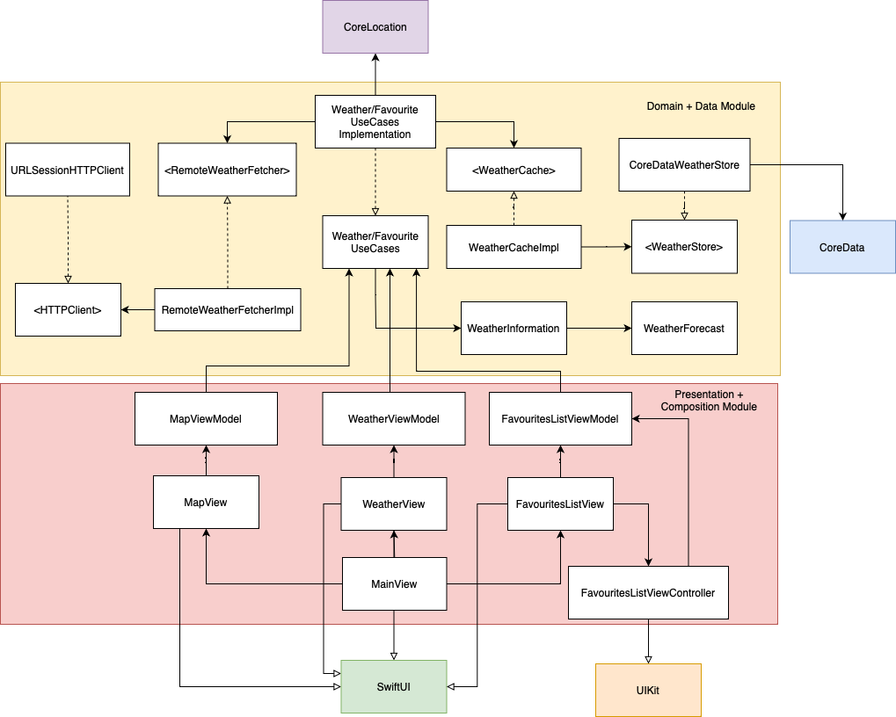

# Weather App

In the following section I added the specifications for the application in a user-story based approach, in order to be clear what the app needs to do.

## Specs

### Story: User requests to see the weather for his current location

### Narative #1

```
As an online geolocated user
I want to be able to see the weather information for my current location
  together with a 5-day forecast and an indication of the last updated date (timestamp)
```

#### Acceptance criteria

```
Given the user has internet connectivity and provided location permissions
  When he requests to see the weather for his current location
    The current location weather is fetched from API and displayed
    The 5-day forecast is fetched from API and displayed
    The old cache is replaced with the new weather information
    A label indicating the last update is displayed

Given the user has internet connectivity,
  When he brings the app into foreground
    The weather information is updated from the API
``` 

### Narative #2

```
As an offline geolocated user
I want to be able to see the cached weather information
  together with an indication of the last updated date (timestamp)
```

#### Acceptance criteria

```
Given the user has no internet connectivity,
  When he requests to see the weather for his current location
  And there is cached weather information
    The current location weather is fecthed from the cache and displayed
    The 5-day forecast if fetched from the cache and displayed
    A label indicating the last update is displayed
    
Given the user has no internet connectivity,
  When he requests to see the weather for his current location
  And there is no cached weather information
    An error is displayed
```

### Narative #3

```
As a non-geolocated (didn't give location permission) user (online/offline)
    I want to see an option to go to Settings app and enable geolocation
```

#### Acceptance criteria

```
Given the user didn't accept location permissions,
  When he opens the app to view current weather information
    The app will display a message to go to Settings and enable location permissions
```

### Story: User requests to see the weather information for his favourite locations

### Narative

```
As a user, I want to be able to add favourite locations and see the weather information
```

#### Acceptance criteria

```
Given the user opens the app,
  When he navigates to the Favourites area
    He will be able to add a new city as favourite and see weather information
```

### Story: User requests to see extra information about his favourite locations

### Narative

```
As a user, I want to be able to see extra information about my favourite locations
```

#### Acceptance criteria

```
Given the user opens the app,
  When he navigates to the Favourites area
    He will be able to select a favourite location and see more details about it
```

### Story: User requests to see favourite locations on map

### Narative

```
As a user, I want to be able to see my favourite locations on a map
```

#### Acceptance criteria

```
Given the user opens the app,
  When he navigates to the Map area
    He will be able to see his favourite locations on the map
```


## App Architecture

In the diagram below we can observe a high level overview of the app's architecture. It is based on MVVM. 

There are 2 modules, one for the domain (i.e. Models) and data-related types (i.e. API/Cache/Repository) + the other for composition and presentation (i.e. the main iOS app).

Having a specific module for domain and data types allows us to run tests on a macOS target which is a lot faster than running the tests on the iOS target, as there is no simulator that needs to be booted up.

In the diagram we can observe a few types in angular brackets `<LikeThis>`, this means this type is a protocol. We used the convention that the type implementing the protocol should have `Impl` suffix (from *impl*ementation), e.g. `LikeThisImpl`. 
The arrows have the following meaning:
1. the arrow with the filled arrow head and filled line means "depends on"
2. the arrow with the empty arrow head and filled line means "inherits from" 
3. the arrow with the empty arrow head and dashed line means "implements from" (for protocols)

We can observe from the diagram that the bottleneck for our design is the `WeatherRepository` protocol, since all our view models depend on it. When implementig we will assess the need to split this repository into smaller ones. 



## Tests

The tests are organized per module.

The end-to-end tests are designed to hit the actual API and prove we have correctness when doing so. They are in a separate test suite because we don't want to slow our test suite down with API calls. These tests are run on the CI

Note we have a CI scheme that incorporates all tests. This scheme is used for code coverage as well.
